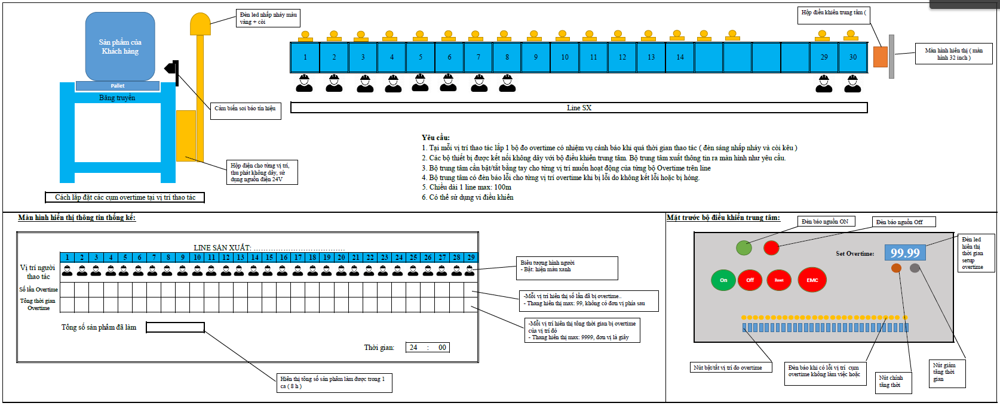

# Dự án quản lý overtime trong dây truyền sản xuất (public)
*Dự án quản lý overtime trong dây truyền sản xuất được phát triển trên LoRa, ESP32, Arduino và C# Winform*

### Giới thiệu
Đây là bản demo cho hệ thống quản lý overtime trong dây chuyền sản xuất để đánh giá hiệu quả công việc của từng line sản xuất.
Bản demo được thiết kế trên EAGLE với mạch một lớp, không tối ưu cho bảng mạch, để áp dụng trong thương mại vui lòng liên hệ tác giả.

### Mô tả hệ thống

